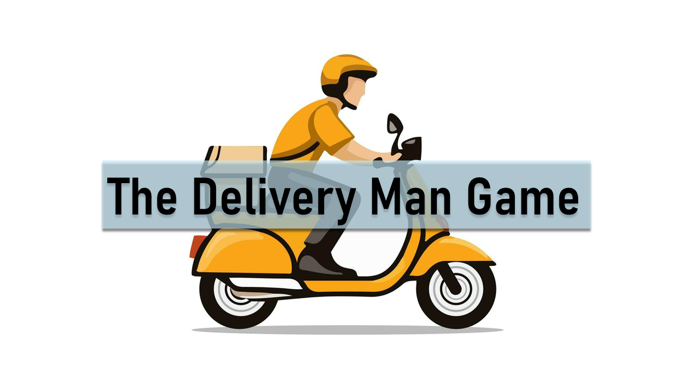
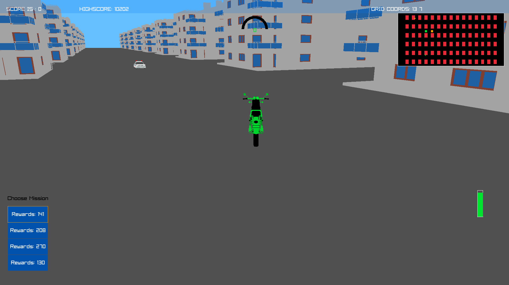
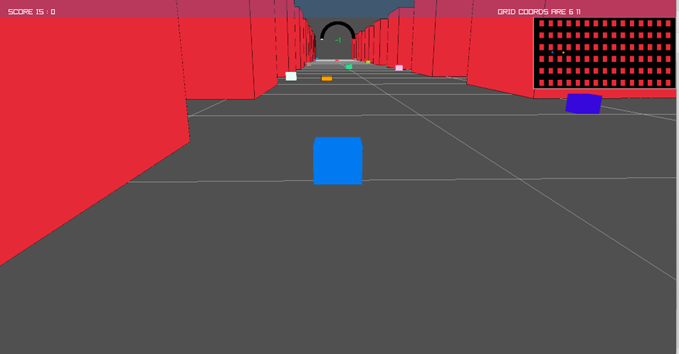
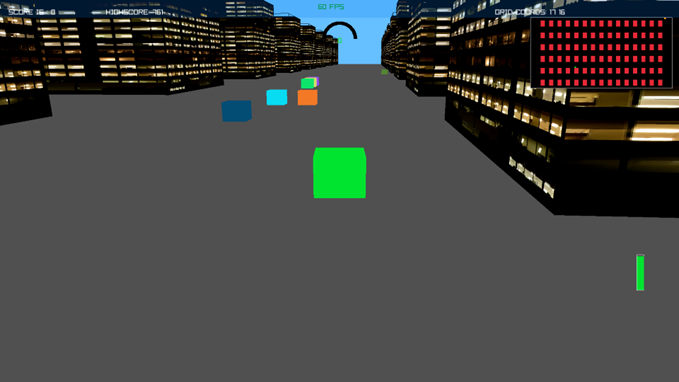
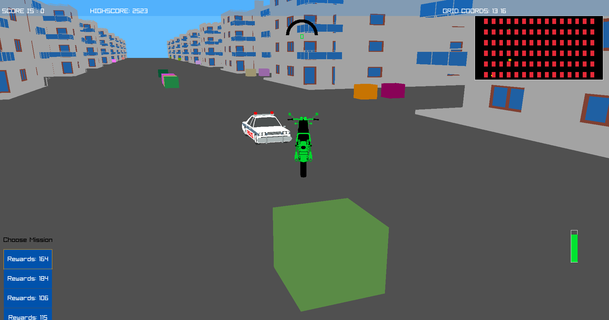
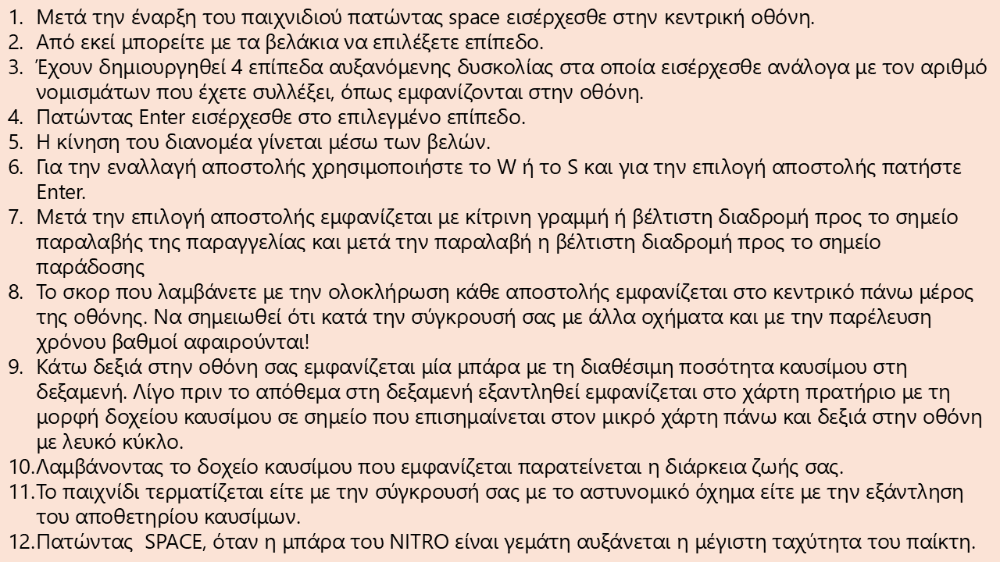

# 🛵 The Delivery Boys

**A pure-C, raylib-powered 3D delivery-driver game.** Grab the order, race the clock, dodge traffic, keep the tank full, and don't let the cops catch you.



Originally built as coursework for **Structured Programming** at the **Aristotle University of Thessaloniki** (Winter Semester 2025–2026), by **Michael Kartsiotis** and **Dimitrios Katsimanis**.

---

## Table of Contents

- [Overview](#overview)
- [Screenshots](#screenshots)
- [Features](#features)
- [Controls](#controls)
- [Getting Started](#getting-started)
- [Project Structure](#project-structure)
- [Development Environment](#development-environment)
- [The Development Journey](#the-development-journey)
- [Procedural Terrain: Perlin Noise & Fractals](#procedural-terrain-perlin-noise--fractals)
- [Engineering Challenges](#engineering-challenges)
- [Known Limitations & Roadmap](#known-limitations--roadmap)
- [Use of AI Tools](#use-of-ai-tools)
- [Full Function Reference](#full-function-reference)
- [Credits & Licensing](#credits--licensing)
- [Acknowledgments](#acknowledgments)

---

## Overview

You're a gig-economy delivery driver. Your job: pick up as many orders as possible from health-focused stores around the city and get them to customers by the optimal route, while burning as little fuel as possible — because fuel is what keeps you alive. A police car is on patrol and will chase you down if you get careless, and since traffic laws are more of a suggestion for a courier in a hurry, you'll often find yourself breaking them to make the delivery window.

Before accepting a job, you see a list of available missions and their maximum payout. Selecting one shows you what you'd currently earn if you delivered it right now — that payout shrinks the longer you take and if you collide with other vehicles, so speed and clean driving both matter.

## Screenshots

| | |
|---|---|
|  |  |
|  |  |

*Four difficulty levels, unlocked progressively as your score in the previous level improves.*



## Features

- 🗺️ **Live delivery map** — active missions, pickup/dropoff points, and your position, all tracked in real time
- 🧭 **A\* pathfinding** — computes and draws the optimal route to pickup, then to dropoff, on a grid overlaid on the map
- 🚓 **Police pursuit** — a patrol car actively chases you; get caught and the run ends
- 🚗 **Simulated traffic** — NPC vehicles obey lane direction and traffic-light logic; you're free to ignore both, at your own risk
- ⛽ **Fuel management** — replaces a simple timer: burn fuel to survive, refuel at randomly-placed gas stations before you run dry
- 🏆 **Scoring with time pressure** — full payout for on-time delivery, bonus for beating the clock, penalties for lateness or collisions
- 🔓 **Four levels of increasing difficulty** — more traffic, tougher patrols, and higher score requirements to unlock each one, with a save file tracking your high scores
- 🌌 **3D world** — buildings, roads, and procedurally generated terrain surrounding the play area
- 🎮 **Nitro boost** — a rechargeable speed boost for when you're cutting it close
- 🎵 **Dynamic audio** — background music that switches during drift/chase moments
- 🌙 **Night mode**

## Controls

| Key | Action |
|---|---|
| `Space` (on title screen) | Enter the main menu |
| `↑` / `↓` | Select a level |
| `Enter` | Confirm level selection / start |
| `Arrow keys` | Drive |
| `W` / `S` | Cycle through available delivery missions |
| `Enter` (mission list) | Accept the highlighted mission |
| `Space` (in-game) | Activate Nitro, once the bar is full |

**Reading the HUD:**
- Score is shown top-center and updates as you complete deliveries — colliding with traffic or running out the clock deducts points.
- The fuel gauge sits in the corner of the screen; when it's low, a gas station appears on the minimap, marked with a white circle.
- Picking up fuel at the station extends how long you can keep driving.
- The run ends if the police car catches you, or if you run out of fuel entirely.

## Getting Started

### Requirements

- **GNU GCC** — [download for Windows here](https://www.mingw-w64.org/); on most Linux/Unix distributions it's already installed; on macOS you'll need to install it (or use another C toolchain with equivalent build commands).
- On Windows, after installing GCC, add its `bin` folder to your system `PATH` environment variable (System Properties → Environment Variables → Path → New → paste the folder).
- **make** is recommended if it isn't already bundled with your GCC install.

### Building

#### Option A — via Make

Open a terminal in the project folder.

**Windows:**
```bash
mingw32-make
```

**Linux / macOS:** the included `Makefile` targets Windows by default, so first:
1. Open `Makefile` in your editor.
2. Find `TARGET := game.exe` near the top and change it to `TARGET := game`.
3. Near the `clean:` rule at the bottom, remove the Windows-style clean line and uncomment the Unix-style one.
4. Then run:
```bash
make
```
(Linking against raylib is handled automatically via macros already in the Makefile.)

#### Option B — directly with gcc

**Windows:**
```bash
gcc -Wall -Wextra -O2 -std=c17 -I./raylib_2/include -c main.c -o main.o
gcc -Wall -Wextra -O2 -std=c17 -I./raylib_2/include -c layout.c -o layout.o
gcc -Wall -Wextra -O2 -std=c17 -I./raylib_2/include -c player_movement.c -o player_movement.o
gcc -Wall -Wextra -O2 -std=c17 -I./raylib_2/include -c draw.c -o draw.o
gcc -Wall -Wextra -O2 -std=c17 -I./raylib_2/include -c gamehandling.c -o gamehandling.o
gcc -Wall -Wextra -O2 -std=c17 -I./raylib_2/include -c astar_search.c -o astar_search.o
gcc -Wall -Wextra -O2 -std=c17 -I./raylib_2/include -c npc.c -o npc.o
gcc -Wall -Wextra -O2 -std=c17 -I./raylib_2/include -c cam.c -o cam.o
gcc -Wall -Wextra -O2 -std=c17 -I./raylib_2/include -c audio.c -o audio.o

gcc main.o layout.o player_movement.o draw.o gamehandling.o astar_search.o npc.o cam.o audio.o \
  -L./raylib_2/lib -l:libraylib.a -lopengl32 -lgdi32 -lwinmm -luser32 -lkernel32 -lshell32 -o game.exe
```

**Linux:**
```bash
gcc main.o layout.o player_movement.o draw.o gamehandling.o astar_search.o npc.o cam.o audio.o \
  -L./raylib_2/lib -lraylib -lGL -lm -lpthread -ldl -lrt -lX11 -o game
```

**macOS:**
```bash
gcc main.o layout.o player_movement.o draw.o gamehandling.o astar_search.o npc.o cam.o audio.o \
  -L./raylib_2/lib -lraylib -framework CoreVideo -framework IOKit -framework Cocoa -framework GLUT -framework OpenGL -o game
```

### Runtime Libraries & Assets

Everything needed (the raylib library, the 3D models, audio, and the prebuilt `game.exe`) ships in this repo, so **Windows** users can build and run immediately.

**Linux & macOS:** the packaged `game.exe` won't run natively — either use a Windows-compatible-executable layer, or (recommended) build from source as above. Because of GitHub's file size limits, you'll also need to fetch raylib yourself from [its GitHub repo](https://github.com/raysan5/raylib), then copy the library folder into this project's root.

> ⚠️ **Important:** the folder containing raylib must be named `raylib_2`, not `raylib` — the build commands and Makefile both expect that exact name.

### Running

**Windows:**
```bash
.\game.exe
```

**Linux / macOS:**
```bash
./game
```

## Project Structure

| File | Purpose |
|---|---|
| `main.c` | Entry point — game loop, screen state machine |
| `headers.h` | Shared declarations: all function prototypes, structs, enums, `#define` constants, and global externs |
| `layout.c` | Map/grid initialization, per-level game-parameter setup |
| `draw.c` | All 2D/3D rendering — map, HUD, A* path, NPCs, score, fuel/nitro bars, delivery list |
| `player_movement.c` | Player input, collision detection, boundary clamping |
| `gamehandling.c` | Mission (pickup/dropoff) logic, scoring, fuel consumption, gas stations |
| `astar_search.c` | A\* pathfinding: grid construction, heuristic, search, coordinate conversion |
| `npc.c` | Police-chaser AI, ambient traffic simulation, collision checks |
| `cam.c` | 3D camera control and screen/level transitions |
| `audio.c` | Music playback and track switching |
| `Makefile` | Build rules (GNU Make) |
| `raylib_2/` | Bundled raylib library (headers + static lib) |
| `*.glb` | 3D models (buildings, vehicles, gas tank) |
| `LEVEL1–4.png`, `PreviewImage.png`, `PREVIEWSCREENINSTUCTIONS.png` | Screenshots |
| `BACKROUND.mp3`, `DRIFT.mp3` | Music tracks |
| `LISCENCE.txt` | Project license (GPL-3.0) |
| `RAYLIB_LICENSE.txt` | raylib's own license (zlib) |
| `Readme.pdf` | Original, full academic report submitted for the course |

📄 Full per-function documentation for every `.c` file lives in [`docs/FUNCTION_REFERENCE.md`](docs/FUNCTION_REFERENCE.md).

## Development Environment

Built on Windows 11 using **VS Code** and **Code::Blocks**, with the raylib library vendored directly into the project folder. Per the course requirements, the source is split into eight translation units plus one shared header, built through a single `Makefile`. The two authors collaborated using **Git** and **GitHub** for version control and backup.

3D models were prototyped in **Blender**; a 3D-slicing tool was tried early on but dropped in favor of doing everything in Blender once its workflow proved more convenient.

## The Development Journey

<details>
<summary><b>Phase 1 — Initial Design & Rethinking Movement</b></summary>

<br>

The first attempt at player movement on the world map avoided raylib's built-in camera entirely. Three approaches were tried: a bounded player-coordinate system, a fixed player-in-center-of-screen system where the world moves instead, and a hybrid of both.

All three were abandoned — boundary handling got too complex, there was no clean coordinate system, and file/function organization was becoming unmanageable. Development restarted around raylib's camera function, with a new focus on optimal-pathfinding (Micromouse-style algorithms).

</details>

<details>
<summary><b>Phase 2 — Core Gameplay & Pathfinding</b></summary>

<br>

Core game logic came together: the pickup/delivery system, a time-limit mechanic (later replaced — see Phase 6), and early research into 3D rendering. The A\* pathfinding algorithm was implemented here: the map was divided into a grid, array-initialization logic was adapted to it, and the optimal route could finally be drawn on screen.

</details>

<details>
<summary><b>Phase 3 — NPC Handling & the Move to 3D</b></summary>

<br>

Applying A\* to NPC movement made the codebase unmanageably complex, so it was dropped for NPCs in favor of much simpler "zombie logic" (direct movement toward a target). This phase also introduced the 3D environment itself, improved controls, a speedometer, and early 3D effects.

</details>

<details>
<summary><b>Phase 4 — Traffic Optimization</b></summary>

<br>

Three low-cost "industry trick" techniques were evaluated for simulating traffic flow: alternating flow based on road-index parity (to fake two-way streets), brake-light logic (distance checks to prevent vehicles overlapping), and a global timer-driven traffic-light system for intersections.

</details>

<details>
<summary><b>Phase 5 — Level Design & Memory Management</b></summary>

<br>

Multiple difficulty tiers were built out — empty roads with a slow patrol car at Level 1, scaling up to full traffic and a fast patrol at Level 3+. To avoid dynamic allocation (`calloc`) and resizing, the team switched to large fixed-size arrays with adjusted access logic, driven by `extern` variables for per-level parameters. A level-locking system was added, unlocking levels based on high scores, plus a cheat code and preview-screen navigation. High scores are persisted to file in the format `-%LOCKEDLEVEL-%SCORE1-%SCORE2-%SCORE3-`.

</details>

<details>
<summary><b>Phase 6 — Scoring & Fuel Systems</b></summary>

<br>

Scoring was reworked around Manhattan distance between pickup and dropoff, with penalties for collisions and elapsed time. The original time-limit mechanic was replaced entirely by a fuel system — the run ends when the tank is empty, not when a clock runs out — and gas stations were introduced as a new object type with randomized placement. Night Mode was also added here.

</details>

<details>
<summary><b>Phase 7 — Final Polish & QA</b></summary>

<br>

Closing bug fixes addressed NPCs getting stuck at certain points and a speedometer that misreported -1/-2 while stationary. Graphics/performance passes added full-screen mode, improved FPS, and refined the color palette. A proper "Game Over" screen was added, Score was renamed to Coins in the UI, and time-based negative scoring was implemented. The build was verified for package size (2–3 MB compressed) and header/comment correctness. Final 3D assets — buildings, scooters, NPCs, sidewalks — and the music were added last.

</details>

## Procedural Terrain: Perlin Noise & Fractals

The hills surrounding the playable area are generated with layered **Perlin noise** — Ken Perlin's smooth gradient-noise algorithm, commonly used for terrain, textures, and other pseudo-random patterns. Stacking multiple "octaves" of noise, each at double the frequency and reduced amplitude of the last, produces the fractal-like, natural-looking terrain you see (a technique also used for mountains and clouds in other applications).

It was chosen for two reasons: it drops in cleanly using raylib's own helper functions without requiring complex math, and it's cheap in both memory and compute. The terrain-generation approach itself leaned on [raylib's heightmap-rendering example](https://www.raylib.com/examples/models/loader.html?name=models_heightmap_rendering) for the 2D-image-to-3D-model pipeline, and an AI research tool was used to help find a smoothing algorithm — a linear height falloff applied around a given radius of the model — to clean up the result under a tight deadline. Background reading on Perlin noise came from [this reference](https://www.cs.montana.edu/courses/spring2005/525/students/Thiesen1.pdf), and the original idea of using fractal terrain traces back to a university lecture on time series, chaos, and Hausdorff/fractal dimensions.

## Engineering Challenges

The single biggest challenge throughout the project was holding a decent frame rate. Repeatedly drawing 3D models every frame is expensive, so a large share of the effort went into hunting the codebase for inefficiencies and oversights — slow going, given the size of the project. Approaches tried to claw back performance:

1. **Instanced rendering** for static geometry
2. **Throttled updates** — running NPC updates and A\* recalculation only at fixed intervals rather than every frame
3. **Selective rendering** — only drawing geometry near the player/camera

## Known Limitations & Roadmap

The current version has a few acknowledged trade-offs:

- **Grid-based, orthogonal layout.** Keeping the game simple was the top priority, and the time saved there was reinvested into the 3D version instead — so the map doesn't (yet) capture the feel of a real city with angled streets, traffic-light signals, or more elaborate visuals. Level count is limited as a result. Procedurally generating levels is an interesting future direction, but it would require significant architecture changes that weren't feasible in the time available.
- **Simple NPC traffic behavior.** For simplicity, traffic NPCs move in straight lines and appear/disappear somewhat abruptly at the edges of the play area. A more advanced version would swap cars between vertical and horizontal roads and support actual turning.
- **Vehicle selection isn't implemented yet.** The original design called for buying/selecting different vehicles (e.g. electric scooters, bicycles) with different cost, maintenance, fuel, and speed trade-offs — planned, not yet built.
- The project is released under an open-source license specifically so future contributions and improvements are possible.

## Use of AI Tools

In the interest of transparency: AI tools were used during development, but **no code was copied from them**. Specifically, Gemini was used for research purposes only — mainly early on, to get oriented with raylib's API and licensing questions, and later to help think through possible directions during the terrain-smoothing work described above. All implementation decisions and code were written by the authors.

Other resources that were genuinely useful: *Linear Programming* (Siskos, 2009) and *Non-linear Optimization Methods* (Georgiou & Vasileiou, 1993), particularly for understanding and choosing a pathfinding algorithm; and classmate Yagovnikov Mykhailo, who helped with understanding the build/linking process and what `make` could do.

## Full Function Reference

Every function implemented across the eight `.c` files — `layout.c`, `draw.c`, `player_movement.c`, `gamehandling.c`, `astar_search.c`, `npc.c`, `cam.c`, and `audio.c` — is documented with its signature, purpose, and parameters in **[`docs/FUNCTION_REFERENCE.md`](docs/FUNCTION_REFERENCE.md)**.

## Credits & Licensing

**This project's code** is licensed under **GPL-3.0**, as stated in the header of every source file and in `LISCENCE.txt`.

> **Note:** GitHub currently shows this repository's detected license as *zlib* — that's because it's picking up `RAYLIB_LICENSE.txt` (which covers raylib itself, not this project's code). Renaming `LISCENCE.txt` to `LICENSE.txt` should let GitHub detect the correct GPL-3.0 license for the project.

**raylib** is used under its own zlib license — © 2013-2024 Ramon Santamaria ([@raysan5](https://github.com/raysan5)).

**3D models** were sourced from [free3d.com](https://free3d.com/) (terms: [free3d.com/help/en/articles/9937612-terms-conditions](https://free3d.com/help/en/articles/9937612-terms-conditions)) and modelvault3d.com.pl, then modified for this project:

- Bus: [free3d.com/3d-model/bus-setia-negara-low-poly-557005.html](https://free3d.com/3d-model/bus-setia-negara-low-poly-557005.html)
- Motorbike: [free3d.com/3d-model/simple-motorcycle-2-981288.html](https://free3d.com/3d-model/simple-motorcycle-2-981288.html)
- Cars: [free3d.com/3d-model/low-poly-car-92833.html](https://free3d.com/3d-model/low-poly-car-92833.html), [free3d.com/3d-model/ford-pick-up-577519.html](https://free3d.com/3d-model/ford-pick-up-577519.html)
- Fuel canister: [modelvault3d.com.pl](https://modelvault3d.com.pl/elementor/fuel-canister-jerrycan-3d-model/)
- Building: [free3d.com/3d-model/buildinghouse-04-40137.html](https://free3d.com/3d-model/buildinghouse-04-40137.html)

> **Disclaimer:** per the source sites' licensing terms, redistributing these 3D model files on their own, without permission from their original creators, is not permitted. They're included here strictly for the purposes of this coursework's evaluation; the original creators bear no responsibility for any redistribution or publication of these assets outside that context. Use of the *game's own source code*, however, is permitted under its license.

**Music** is Creative-Commons licensed, from [opengameart.org](https://opengameart.org/content/matts-creative-commons-music) and [pixabay.com](https://pixabay.com/music/search/drifting/).

**Title-screen icon:** Oleksandr Yashnyi. All other imagery was created by the authors and is available under **CC 4.0**.

## Acknowledgments

Thanks to our families and classmates for their support, and especially for the feedback that meaningfully improved the quality of the final game.

---

*Structured Programming — Aristotle University of Thessaloniki, Winter Semester 2025–2026*
